
## Einführung

### Organisation

- Vorlesung
  - [Alexander Tismer](https://www.ihs.uni-stuttgart.de/institut/team/Tismer/)
  <!-- .element: target="_blank" -->
- Übung
  - [Marco Zorn](https://www.ihs.uni-stuttgart.de/institut/team/Zorn/)
  <!-- .element: target="_blank" -->
- Sprechstunde 
  - Termine nach Vereinbarung
- Prüfung mündlich 40 Minuten
  - Termine nach Vereinbarung

  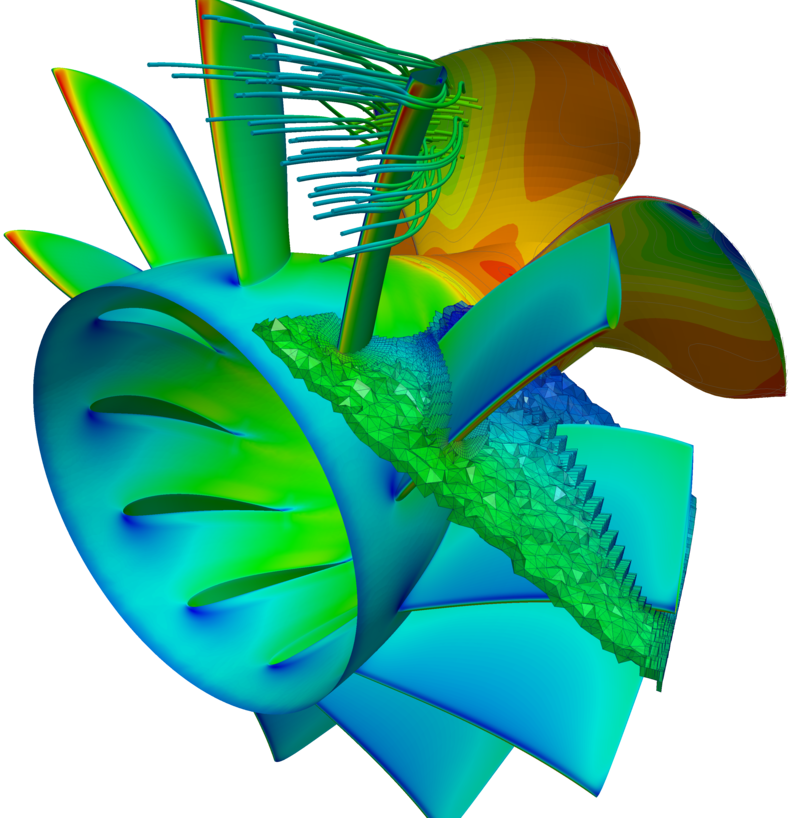

### Zeitplan

  
| Thema                   |       |
|------------------------:|:-----:|
| Einführung              | 1     |
| Grundgleichungen        | 2     |
| Ortsdiskretisierung FDM | 3/4   |
| Turbulenz               | 5/6   |
| Zeitdiskretisierung FDM | 7     |
| FVM                     | 8/9   |
| Turbomaschinen          | 10    |
| Geometrie               | 11    |
| Vernetzung              | 12    |
| Optimierung             | 13/14 |

| Thema                      |       |
|---------------------------:|:-----:|
| Ortsdiskretisierung (H)    | 1     |
| Zeitdiskretisierung (H)    | 2     |
| Einführung (CFX)           | 3     |
| Backward-Facing-Step (CFX) | 4     |
| Rechnerübungen             | 5/6   |
| Simulation Turbine (CFX)   | 7     |
| Rechnerübungen             | 8/9   |
| Vernetzung (H)             | 10    |
| Optimierung                | 11/12 |

10 Vorlesungen in 14 x 90 Minuten und 9 Übungen in 12 x 90 Minuten 
1 x Institutsbesichtigung und 2 x Offene Sprechstunde

### Literatur

+ **Ferziger, J. H.; Peric, M.**; "Numerische Strömungsmechanik"; 
  Springer-Verlag, 2008
+ **Laurien, E.; Örtel, H.**; "Numerische Strömungsmechanik"; 
  Vieweg-Verlag, 2010
+ **Pope, S. B.**; "Turbulent Flows"; Cambridge Univ. Pr., 2006
+ **Moukalled, F.; Mangani, L.; Darwish, M.**;
  "The Finite Volume Method in Computational Fluid Dynamics"; Springer, 2016
+ **Weicker, K.**; "Evolutionäre Algorithmen"; Springer Vieweg, 2015

### Hydraulische Maschine - Auslegung

- Bestehende Anlage
- Saugrohr fix (Änderung sehr teuer)
- Kontour von Nabe und Kranz fix

**Ziel:** 
Möglichst hoher Wirkungsgrad unter Einhaltung der Auslegungsdaten 

<video
  data-autoplay
  data-src="assets/IHSnew_HLRS_reduced.mp4"
  loop="loop"
  width="600"
></video>

[1] Junginger, B.; Investigation of the Influences of Gaps at the Runner 
Blade for an Axial Turbine Using Hybrid Turbulence Models; Bundesprojekt
[axialgap](https://www.gauss-centre.eu/results/computational-and-scientific-engineering/investigation-of-the-influences-of-gaps-at-the-runner-blade-for-an-axial-turbine-using-hybrid-turbulence-models); 
2016

### Hydraulische Maschine - Simulation und Eigenschaften

  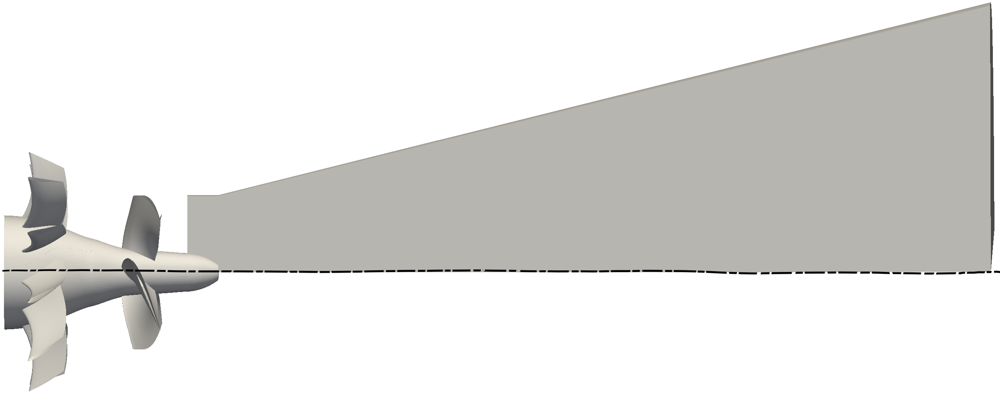
  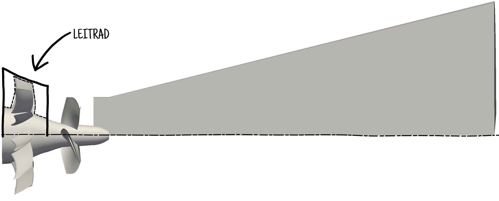
  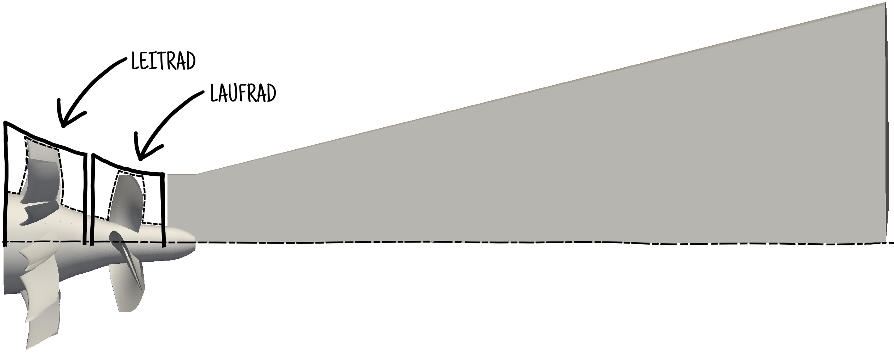
  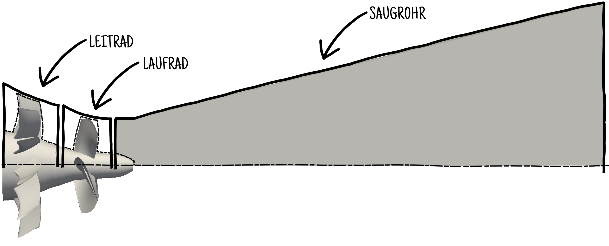
  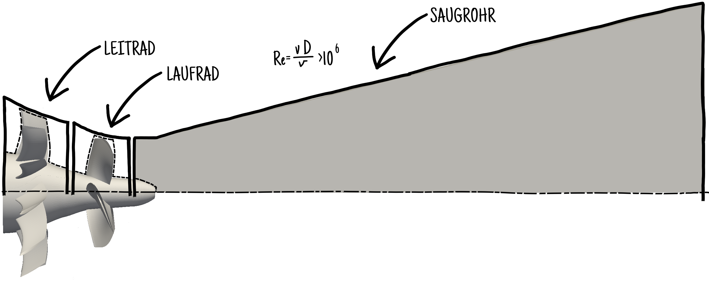
  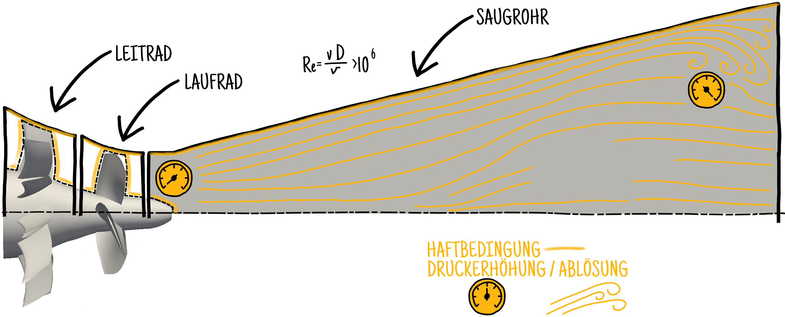
  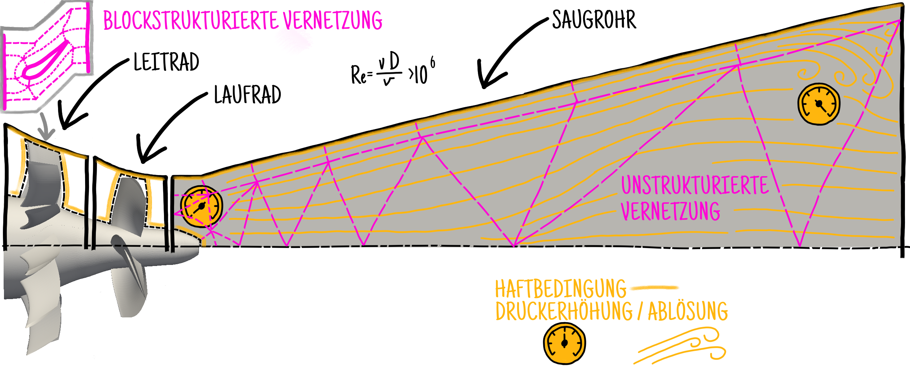
  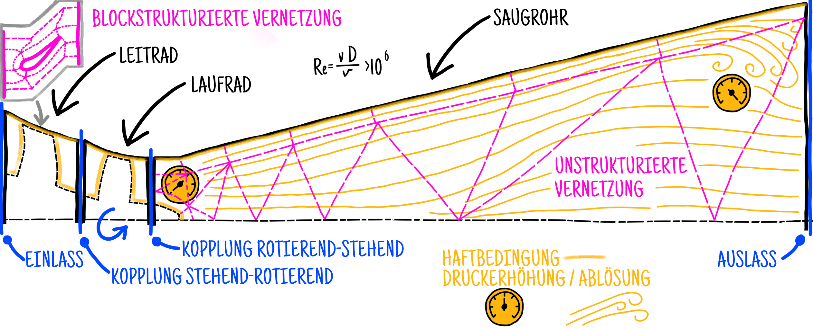
  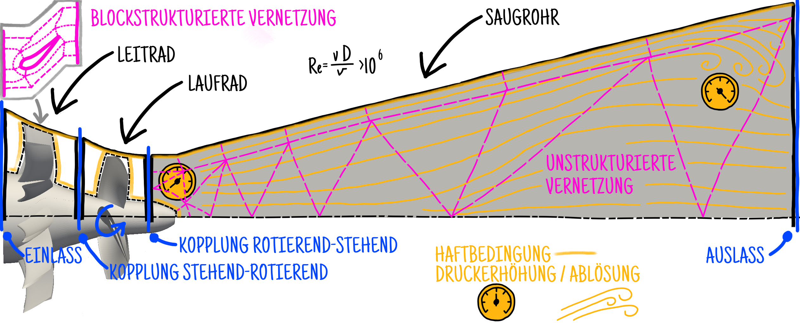
 

- Inkompressible Wasserströmung mit kinematischer Viskosität $\nu = 10^{-6}$
- Rohrturbine mit z.B. $D = 4m$ Durchmesser und einer Zuströmgeschwindigkeit von 
  $v=1\frac{m}{s}$ und damit hohen $Re$-Zahlen bzw. turbulenter Strömung
<!-- .element: class="fragment" data-fragment-index="4" -->
- Steigender Druckgradient
<!-- .element: class="fragment" data-fragment-index="5" -->
- Vernetzung des Strömungsgebiets
<!-- .element: class="fragment" data-fragment-index="6" -->
- Stehende und rotierende Gebiete müssen berechnet und gekoppelt werden
<!-- .element: class="fragment" data-fragment-index="7" -->

### Hydraulische Maschine - Geometrische Beschreibung

  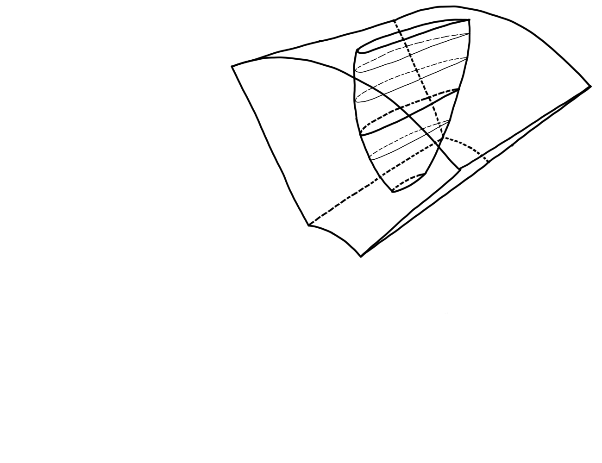
  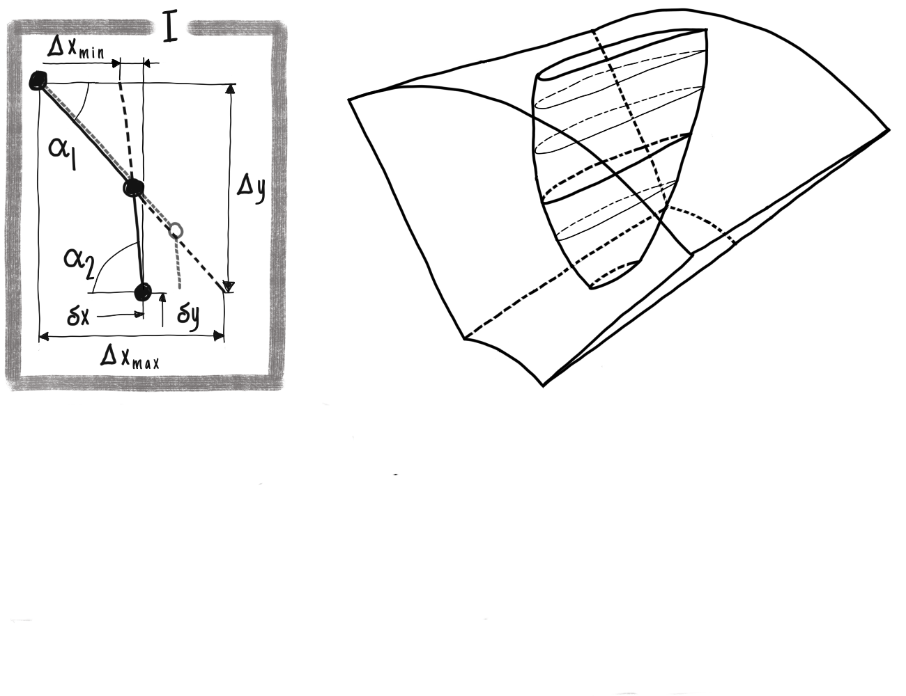
  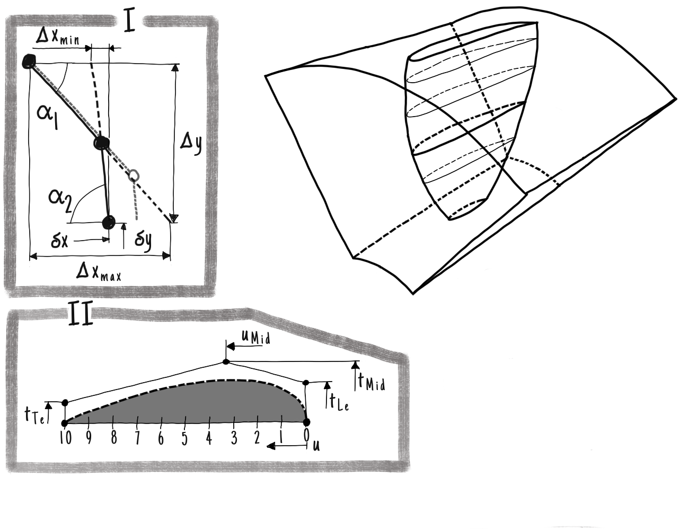
  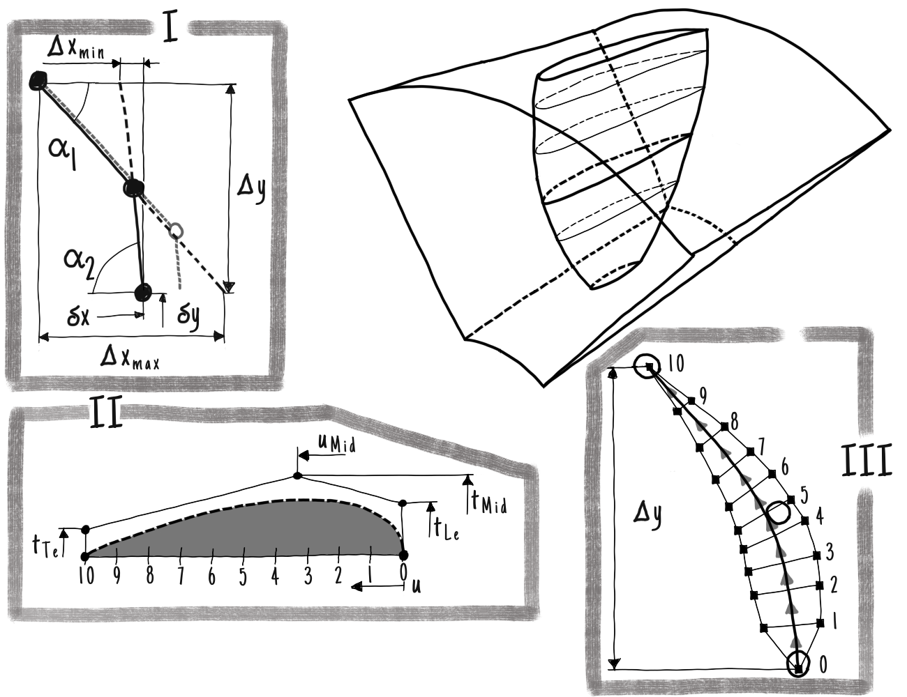
  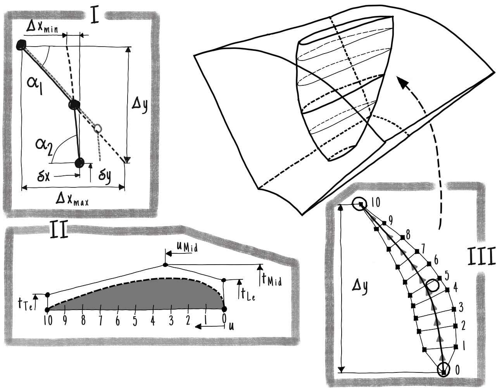

- Auslegung der Maschine auf Blattschnitten 
- Definition von Freiheitsgraden zur Veränderung der Geometrie
- Erzeugung der dreidimensionalen Geometrie durch Verbinden von Kurven 
- Verwendung von nicht-uniformen, rationalen B-Splines (NURBS)

### Grundgleichungen

Beschreibung von Strömungen durch Navier-Stokes-Gleichungen:

`$$
\begin{aligned}
  \frac{\partial{}}{\partial{t}} \underline{u} + 
  \underline{u} \cdot \left( \nabla \cdot \underline{u} \right)
  & =
  \nu \nabla \cdot \left( \nabla \cdot \underline{u} \right) -
  \frac{1}{\rho} \nabla p
  \\
  \nabla \cdot \underline{u} 
  & = 
  0
\end{aligned}
$$`
<!-- .element: class="fragment fade-in-then-out" data-fragment-index="2" -->
`$$
\begin{aligned}
  \textcolor{blue}{\frac{\partial{}}{\partial{t}} \underline{u}} + 
  \textcolor{orange}{\underline{u} \cdot \left( \nabla \cdot \underline{u} \right)}
  & =
  \textcolor{magenta}{\nu \nabla \cdot \left( \nabla \cdot \underline{u} \right)} -
  \textcolor{green}{\frac{1}{\rho} \nabla p}
  \\
  \nabla \cdot \underline{u} 
  & = 
  0
\end{aligned}
$$`
<!-- .element: class="fragment fade-in" data-fragment-index="3" -->

- Unbekannte $\phi$ bzw. $\underline{u}$ und $\underline{p}$ sind 
  kontinuierliche Felder (Kontinuumsmechanik)
<!-- .element: class="fragment fade-in" data-fragment-index="4" -->
- Numerik löst partielle Differentialgleichungen an diskreten Stellen (Gitter)
<!-- .element: class="fragment fade-in" data-fragment-index="5" -->

  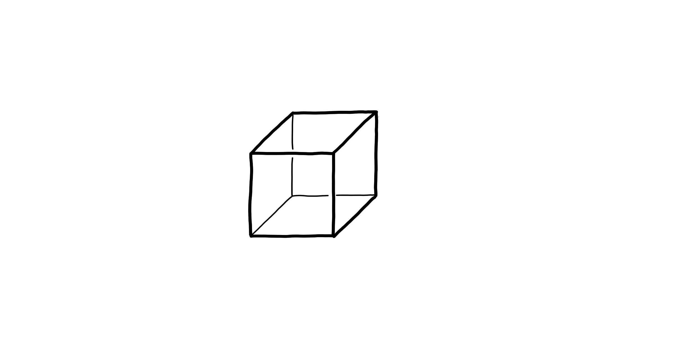
  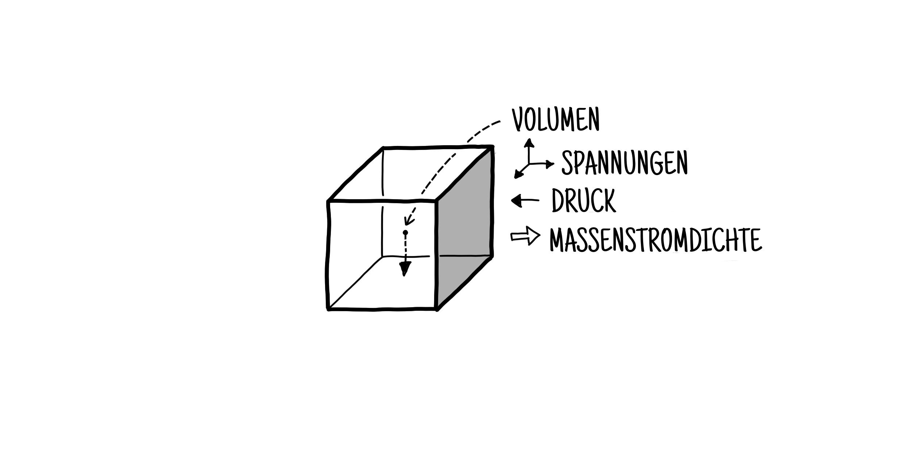
  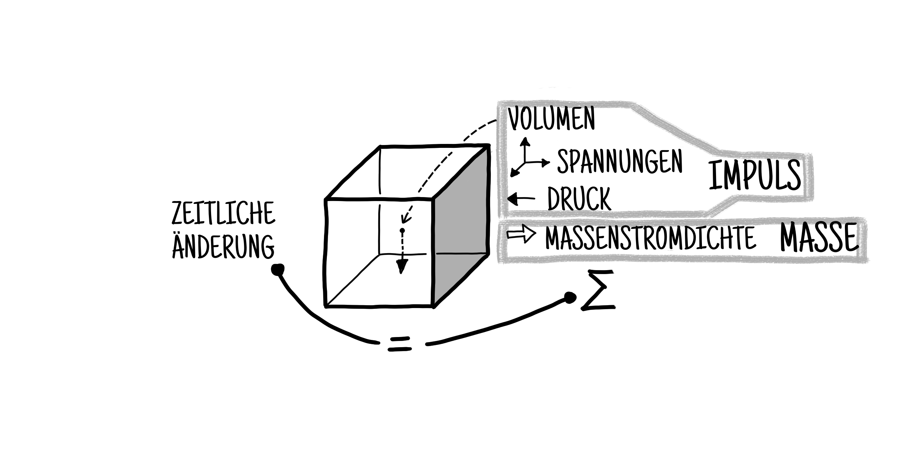
  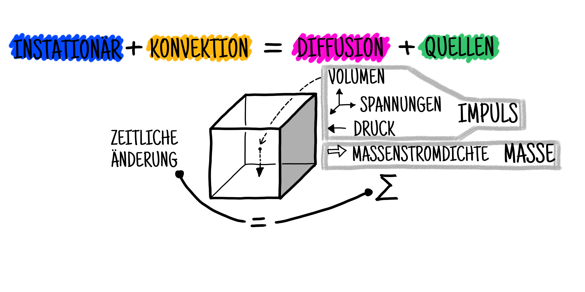
  
  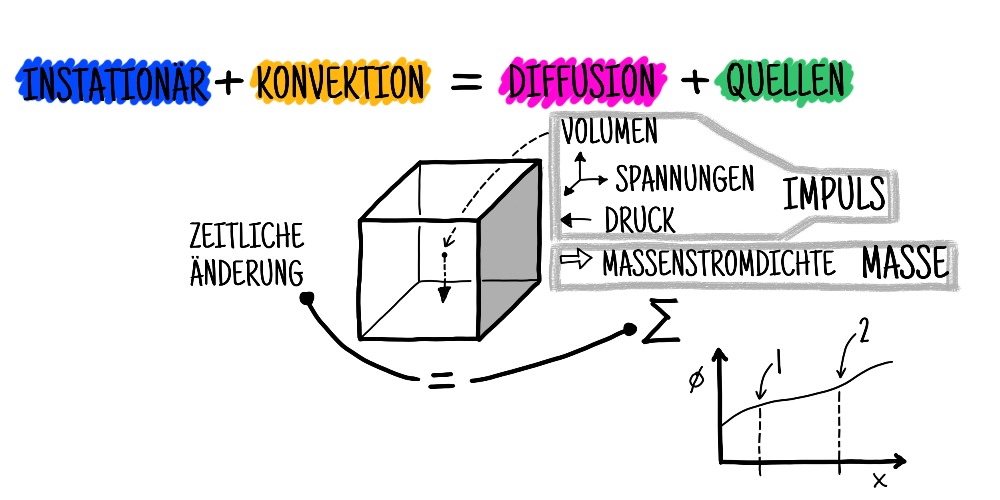

### Finite-Differenzen-Methode

Eindimensionales Konvektions-Diffusions-Problem
`$
u\pp{\phi}{x} = \Gamma \pp{}{x}\pp{\phi}{x}
$` 
mit $u,\Gamma=\mathrm{const}$

`${\scriptsize\begin{aligned}
u \pp{\phi}{x}
  &
  \hide{
    \rightarrow u \dd{\phi}{x}
    \rightarrow \at{u \dd{\phi}{x}}{k}
    \rightarrow u \fd{\phi}{k+1}{k-1}{2 \delta x}
  }
\\
\Gamma \pp{}{x}\pp{\phi}{x}
  &
  \hide{
    \rightarrow  \Gamma \dd{(\dd{\phi}{x})}{x}
    \rightarrow  \at{\Gamma \dd{(\dd{\phi}{x})}{x}}{k}
    \rightarrow  \Gamma \fd{ \at{\dd{\phi}{x}}{} }{ k+1 }{ k }{ \delta x }
    \rightarrow
      \Gamma 
      \frac
        {\fd{\phi}{k+1}{k}{\delta x} - \fd{\phi}{k}{k-1}{\delta x}}
        {\delta x}
  }
  \\
  &
  \hide{
    \rightarrow \Gamma \ffd{\phi}{k+1}{k}{k-1}{\delta x^2}
  }
\end{aligned}}$`
<!-- .element: class="fragment fade-in-then-out" data-fragment-index="0" -->
`${\scriptsize\begin{aligned}
u \pp{\phi}{x}
  &
    \rightarrow u \dd{\phi}{x}
  \hide{
    \rightarrow \at{u \dd{\phi}{x}}{k}
    \rightarrow u \fd{\phi}{k+1}{k-1}{2 \delta x}
  }
\\
\Gamma \pp{}{x}\pp{\phi}{x}
  &
    \rightarrow  \Gamma \dd{(\dd{\phi}{x})}{x}
  \hide{
    \rightarrow  \at{\Gamma \dd{(\dd{\phi}{x})}{x}}{k}
    \rightarrow  \Gamma \fd{ \at{\dd{\phi}{x}}{} }{ k+1 }{ k }{ \delta x }
    \rightarrow
      \Gamma 
      \frac
        {\fd{\phi}{k+1}{k}{\delta x} - \fd{\phi}{k}{k-1}{\delta x}}
        {\delta x}
  }
  \\
  &
  \hide{
    \rightarrow \Gamma \ffd{\phi}{k+1}{k}{k-1}{\delta x^2}
  }
\end{aligned}}$`
<!-- .element: class="fragment fade-in-then-out" data-fragment-index="1" -->
`${\scriptsize\begin{aligned}
u \pp{\phi}{x}
  &
    \rightarrow u \dd{\phi}{x}
    \rightarrow \at{u \dd{\phi}{x}}{k}
  \hide{
    \rightarrow u \fd{\phi}{k+1}{k-1}{2 \delta x}
  }
\\
\Gamma \pp{}{x}\pp{\phi}{x}
  &
    \rightarrow  \Gamma \dd{(\dd{\phi}{x})}{x}
    \rightarrow  \at{\Gamma \dd{(\dd{\phi}{x})}{x}}{k}
  \hide{
    \rightarrow  \Gamma \fd{ \at{\dd{\phi}{x}}{} }{ k+1 }{ k }{ \delta x }
    \rightarrow
      \Gamma 
      \frac
        {\fd{\phi}{k+1}{k}{\delta x} - \fd{\phi}{k}{k-1}{\delta x}}
        {\delta x}
  }
  \\
  &
  \hide{
    \rightarrow \Gamma \ffd{\phi}{k+1}{k}{k-1}{\delta x^2}
  }
\end{aligned}}$`
<!-- .element: class="fragment fade-in-then-out" data-fragment-index="2" -->
`${\scriptsize\begin{aligned}
u \pp{\phi}{x}
  &
    \rightarrow u \dd{\phi}{x}
    \rightarrow \at{u \dd{\phi}{x}}{k}
    \rightarrow u \fd{\phi}{k+1}{k-1}{2 \delta x}
\\
\Gamma \pp{}{x}\pp{\phi}{x}
  &
    \rightarrow  \Gamma \dd{(\dd{\phi}{x})}{x}
    \rightarrow  \at{\Gamma \dd{(\dd{\phi}{x})}{x}}{k}
  \hide{
    \rightarrow  \Gamma \fd{ \at{\dd{\phi}{x}}{} }{ k+1 }{ k }{ \delta x }
    \rightarrow
      \Gamma 
      \frac
        {\fd{\phi}{k+1}{k}{\delta x} - \fd{\phi}{k}{k-1}{\delta x}}
        {\delta x}
  }
  \\
  &
  \hide{
    \rightarrow \Gamma \ffd{\phi}{k+1}{k}{k-1}{\delta x^2}
  }
\end{aligned}}$`
<!-- .element: class="fragment fade-in-then-out" data-fragment-index="3" -->
`${\scriptsize\begin{aligned}
u \pp{\phi}{x}
  &
    \rightarrow u \dd{\phi}{x}
    \rightarrow \at{u \dd{\phi}{x}}{k}
    \rightarrow u \fd{\phi}{k+1}{k-1}{2 \delta x}
\\
\Gamma \pp{}{x}\pp{\phi}{x}
  &
    \rightarrow  \Gamma \dd{(\dd{\phi}{x})}{x}
    \rightarrow  \at{\Gamma \dd{(\dd{\phi}{x})}{x}}{k}
    \rightarrow  \Gamma \fd{ \at{\dd{\phi}{x}}{} }{ k+1 }{ k }{ \delta x }
    \rightarrow
      \Gamma 
      \frac
        {\fd{\phi}{k+1}{k}{\delta x} - \fd{\phi}{k}{k-1}{\delta x}}
        {\delta x}
  \\
  &
    \rightarrow \Gamma \ffd{\phi}{k+1}{k}{k-1}{\delta x^2}
\end{aligned}}$`
<!-- .element: class="fragment fade-in" data-fragment-index="4" -->

  

  Differential
  

  <!-- .element: class="fragment fade-in-then-out" data-fragment-index="0" -->
  

  Differential $\rightarrow$ Differenzen
  

  <!-- .element: class="fragment fade-in-then-out" data-fragment-index="1" -->
  

  Differential $\rightarrow$ Differenzen
  

  <!-- .element: class="fragment fade-in-then-out" data-fragment-index="2" -->
  

  Differential $\rightarrow$ Differenzen $\rightarrow$ lineare Approximation
  

  <!-- .element: class="fragment fade-in-then-out" data-fragment-index="3" -->
  

  Differential $\rightarrow$ Differenzen $\rightarrow$ lineare Approximation
  

  <!-- .element: class="fragment fade-in" data-fragment-index="4" -->

  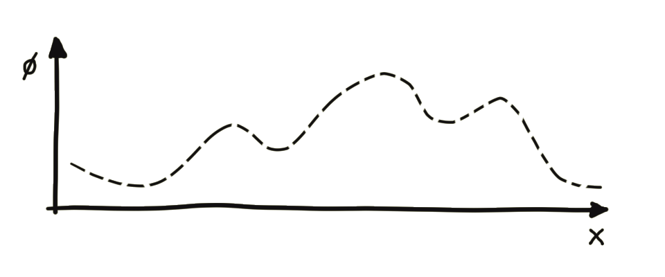
  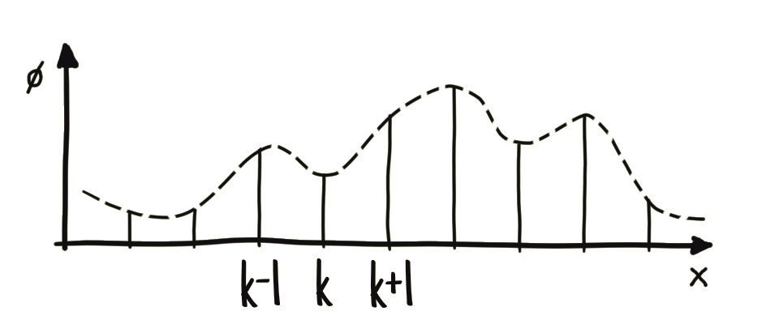

Koeffizienten
`$
\left(
-\frac{u}{2 \delta x}-\frac{\Gamma}{\delta x^2}
\right) \phi_{k-1}
+\left(
\frac{2\Gamma}{\delta x^2}
\right) \phi_{k}
+\left(
\frac{u}{2 \delta x}-\frac{\Gamma}{\delta x^2}
\right) \phi_{k+1} = 0
$`
<!-- .element: class="fragment fade-in" data-fragment-index="5" -->

### Finite-Volumen-Methode

Eindimensionales Konvektions-Diffusions-Problem
`$
u\pp{\phi}{x} = \Gamma \pp{}{x}\pp{\phi}{x}
$` 
mit $u,\Gamma=\mathrm{const}$

`${\scriptsize\begin{aligned}
u \pp{\phi}{x}
  &
  \hide{
    \rightarrow 
      \intV{u\pp{\phi}{x}}
    \rightarrow 
      \intS{u \phi}
    \rightarrow
      - \at{u \phi}{k}
      + \at{u \phi}{k+1} 
    \rightarrow
      - u \frac{\phi_{m-1} + \phi_{m}}{2}
      + u \frac{\phi_m + \phi_{m+1}}{2}
  }
  \\
  &
  \hide{
    \rightarrow
    u\fd{\phi}{m+1}{m-1}{2}
  }
  \\
\Gamma \pp{}{x} \pp{\phi}{x}
  &
  \hide{
    \rightarrow 
      \intV{\Gamma \pp{}{x}\pp{\phi}{x}}
    \rightarrow 
      \intS{\Gamma \pp{\phi}{x}}
    \rightarrow
      - \at{\Gamma\pp{ \phi}{x}}{k}
      + \at{\Gamma \pp{\phi}{x}}{k+1} 
  }
  \\
  &
  \hide{
    \rightarrow
      - \Gamma \fd{\phi}{m}{m-1}{\delta x}
      + \Gamma \fd{\phi}{m+1}{m}{\delta x}
    \rightarrow
    \Gamma \ffd{\phi}{m+1}{m}{m-1}{\delta x}
  }
\end{aligned}}$`
<!-- .element: class="fragment fade-in-then-out" data-fragment-index="0" -->
`${\scriptsize\begin{aligned}
u \pp{\phi}{x}
  &
    \rightarrow 
      \intV{u\pp{\phi}{x}}
    \rightarrow 
      \intS{u \phi}
  \hide{
    \rightarrow
      - \at{u \phi}{k}
      + \at{u \phi}{k+1} 
    \rightarrow
      - u \frac{\phi_{m-1} + \phi_{m}}{2}
      + u \frac{\phi_m + \phi_{m+1}}{2}
  }
  \\
  &
  \hide{
    \rightarrow
    u\fd{\phi}{m+1}{m-1}{2}
  }
  \\
\Gamma \pp{}{x} \pp{\phi}{x}
  &
    \rightarrow 
      \intV{\Gamma \pp{}{x}\pp{\phi}{x}}
    \rightarrow 
      \intS{\Gamma \pp{\phi}{x}}
  \hide{
    \rightarrow
      - \at{\Gamma\pp{ \phi}{x}}{k}
      + \at{\Gamma \pp{\phi}{x}}{k+1} 
  }
  \\
  &
  \hide{
    \rightarrow
      - \Gamma \fd{\phi}{m}{m-1}{\delta x}
      + \Gamma \fd{\phi}{m+1}{m}{\delta x}
    \rightarrow
    \Gamma \ffd{\phi}{m+1}{m}{m-1}{\delta x}
  }
\end{aligned}}$`
<!-- .element: class="fragment fade-in-then-out" data-fragment-index="1" -->
`${\scriptsize\begin{aligned}
u \pp{\phi}{x}
  &
    \rightarrow 
      \intV{u\pp{\phi}{x}}
    \rightarrow 
      \intS{u \phi}
    \rightarrow
      - \at{u \phi}{k}
      + \at{u \phi}{k+1} 
  \hide{
    \rightarrow
      - u \frac{\phi_{m-1} + \phi_{m}}{2}
      + u \frac{\phi_m + \phi_{m+1}}{2}
  }
  \\
  &
  \hide{
    \rightarrow
    u\fd{\phi}{m+1}{m-1}{2}
  }
  \\
\Gamma \pp{}{x} \pp{\phi}{x}
  &
    \rightarrow 
      \intV{\Gamma \pp{}{x}\pp{\phi}{x}}
    \rightarrow 
      \intS{\Gamma \pp{\phi}{x}}
    \rightarrow
      - \at{\Gamma\pp{ \phi}{x}}{k}
      + \at{\Gamma \pp{\phi}{x}}{k+1} 
  \\
  &
  \hide{
    \rightarrow
      - \Gamma \fd{\phi}{m}{m-1}{\delta x}
      + \Gamma \fd{\phi}{m+1}{m}{\delta x}
    \rightarrow
    \Gamma \ffd{\phi}{m+1}{m}{m-1}{\delta x}
  }
\end{aligned}}$`
<!-- .element: class="fragment fade-in-then-out" data-fragment-index="2" -->
`${\scriptsize\begin{aligned}
u \pp{\phi}{x}
  &
    \rightarrow 
      \intV{u\pp{\phi}{x}}
    \rightarrow 
      \intS{u \phi}
    \rightarrow
      - \at{u \phi}{k}
      + \at{u \phi}{k+1} 
    \rightarrow
      - u \frac{\phi_{m-1} + \phi_{m}}{2}
      + u \frac{\phi_m + \phi_{m+1}}{2}
  \\
  &
    \rightarrow
    u\fd{\phi}{m+1}{m-1}{2}
  \\
\Gamma \pp{}{x} \pp{\phi}{x}
  &
    \rightarrow 
      \intV{\Gamma \pp{}{x}\pp{\phi}{x}}
    \rightarrow 
      \intS{\Gamma \pp{\phi}{x}}
    \rightarrow
      - \at{\Gamma\pp{ \phi}{x}}{k}
      + \at{\Gamma \pp{\phi}{x}}{k+1} 
  \\
  &
    \rightarrow
      - \Gamma \fd{\phi}{m}{m-1}{\delta x}
      + \Gamma \fd{\phi}{m+1}{m}{\delta x}
    \rightarrow
    \Gamma \ffd{\phi}{m+1}{m}{m-1}{\delta x}
\end{aligned}}$`
<!-- .element: class="fragment fade-in" data-fragment-index="3" -->

  

  Differential
  

  <!-- .element: class="fragment fade-in-then-out" data-fragment-index="0" -->
  

  Differential $\rightarrow$ Integral mit Divergenztheorem
  

  <!-- .element: class="fragment fade-in-then-out" data-fragment-index="1" -->
  

  Differential $\rightarrow$ Integral mit Divergenztheorem
  

  <!-- .element: class="fragment fade-in-then-out" data-fragment-index="2" -->
  

  Differential $\rightarrow$ Integral mit Divergenztheorem
  $\rightarrow$ lineare Approximation
  

  <!-- .element: class="fragment fade-in" data-fragment-index="3" -->

  
  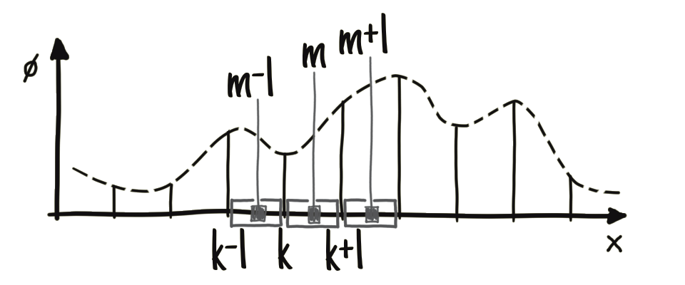

Koeffizienten
`$
\left(
-\frac{u}{2}-\frac{\Gamma}{\delta x}
\right) \phi_{m-1}
+\left(
\frac{2\Gamma}{\delta x}
\right) \phi_{m}
+\left(
\frac{u}{2}-\frac{\Gamma}{\delta x}
\right) \phi_{m+1} = 0
$`
<!-- .element: class="fragment fade-in" data-fragment-index="4" -->

### Lineares Gleichungssystem

FVM liefert
`$
\left(
-\frac{u}{2}-\frac{\Gamma}{\delta x}
\right) \phi_{m-1}
+\left(
\frac{2\Gamma}{\delta x}
\right) \phi_{m}
+\left(
\frac{u}{2}-\frac{\Gamma}{\delta x}
\right) \phi_{m+1} = 0
$`

- Koeffizienten für die `$m$`-te Zeile
- Analoges Aufstellen für alle anderen Auswertestellen liefern das lineare 
  Gleichungssystem

`$${\scriptsize
\begin{bmatrix}
\blacksquare & \blacksquare & 0  & \dots & \dots & \dots & 0\\
\blacksquare & \ddots & \ddots & 0 & & & \vdots\\
0 & \ddots & \ddots  & \ddots & 0 &  & \vdots\\
\vdots & 0 & \blacksquare  & \blacksquare & \blacksquare& 0 & \vdots\\
\vdots & & 0 & \ddots & \ddots& \ddots & 0\\
\vdots & & & 0 & \ddots& \ddots & \blacksquare\\
0 & \dots & \dots  & \dots & 0 & \blacksquare & \blacksquare\\
\end{bmatrix}
\begin{bmatrix}
\phi_1 \\
\vdots \\
\phi_m \\
\vdots \\
\phi_N \\
\end{bmatrix}
= \begin{bmatrix}
0 \\
\vdots \\
0 \\
\vdots \\
0 \\
\end{bmatrix}
\mathrm{mit} \; \blacksquare \; \mathrm{für\ Einträge} \neq 0
}$$`

- Matrix hat für den gezeigten Fall eine Bandstruktur
- Matrix ist fast immer schwachbesetzt und die Besetzungsstruktur ist abhängig 
  vom verwendeten Berechnungsgitter

### Turbulenzmodellierung

<video
    data-autoplay
    data-src="assets/elbow_turbulenz.mp4"
    loop="loop"
    width="500">
</video>

- Lösung der Navier-Stokes-Gleichungen (DNS)
  - Auflösung aller Wirbelskalen
- Rechenaufwand bei großer $Re$-Zahl mehr als 100 Jahre
- Komplette oder teilweise Modellierung der Wirbelskala
  - RANS (zeitliche Mittelung) oder LES (räumliche Filterung)

Bei RANS entsteht der Reynoldsspannungstensor aus den nicht-linearen
Konvektionstermen in

`${\scriptsize
  \pp{}{t} \uv + 
  \underbrace{
    \uv \cdot \left( \nabla \cdot \uv \right)
  }_{
  \mathrm{nicht-linear}
  } =
  \nu \nabla \cdot \left( \nabla \cdot \underline{u} \right) -
  \frac{1}{\rho} \nabla p
}$`

Dieser Tensor wird durch Turbulenzmodellierung approximiert.

[1] Krappel, T.; Large Eddy Simulation of a Complete Francis Turbine; 
Bundesprojekt
[LESFT](https://www.gauss-centre.eu/results/computational-and-scientific-engineering/large-eddy-simulation-of-a-complete-francis-turbine?no_cache=1&sword_list%5B0%5D=krappel&cHash=fd004c0078d48dc042bd56d5bf051285); 
2020

### Evolutionäre Optimierung

__Ausgangspopulation__ 
Kleine Schlangen mit großen Mäulern

Frisst zu große, giftige Kröten
- Kleiner Organismus kann Menge an Gift nicht verdauen

__Selektionsfaktor__ 
Giftige Aga-Kröte

Einige Schlangen verändern sich

- Mutation
- Paarung (Rekombination)

__Neue Population__ 
Große Schlange mit kleinen Mäulern

Bessere Anpassung an Selektionsfaktor

- Können nur kleinere Kröten mit weniger Gift fressen
- Größerer Organismus ermöglicht Verdauung

### Evolutionäre Optimierung - Teilturbine

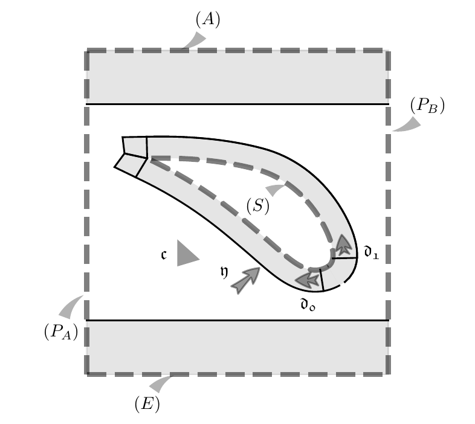

- Strömung durch Eintritt $(E)$, Umströmung des Profils $(S)$ und Austritt 
durch $(A)$
- Periodische Flächen $(P_A)$ und $(P_B)$
- Strukturierte Bereiche des Netzes sind grau dargestellt
- Gütefunktion ist ein gewichtetes Mittel aus Kavitation, Wirkungsgrad und 
  Fallhöhe

Ergebnisse und Initialisierung der Optimierungen 
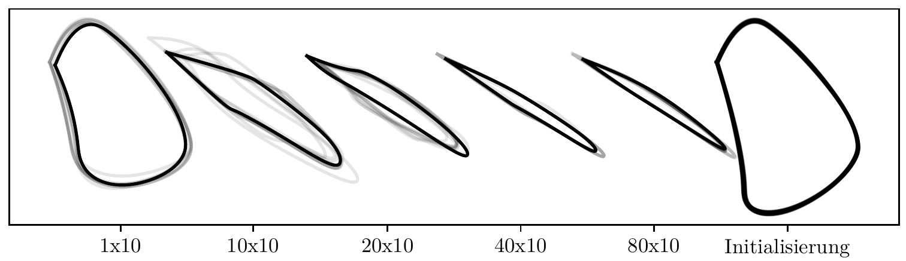

[1] Tismer, A.; Entwicklung einer Softwareumgebung zur automatischen Auslegung 
    von hydraulischen Maschinen mit dem Inselmodell; 2020;
    [ISBN 978-3-948328-01-6](https://elib.uni-stuttgart.de/handle/11682/11108) 

### Evolutionäre Optimierung - Teilturbine

<video
    data-autoplay
    data-src="assets/bs_small_80x10_pareto_fit.mp4"
    loop="loop"
    width="700">
</video>

[1] Tismer, A.; Entwicklung einer Softwareumgebung zur automatischen Auslegung 
    von hydraulischen Maschinen mit dem Inselmodell; 2020;
    [ISBN 978-3-948328-01-6](https://elib.uni-stuttgart.de/handle/11682/11108) 

### Anwendung: Wasserkraftwerk in Nepal

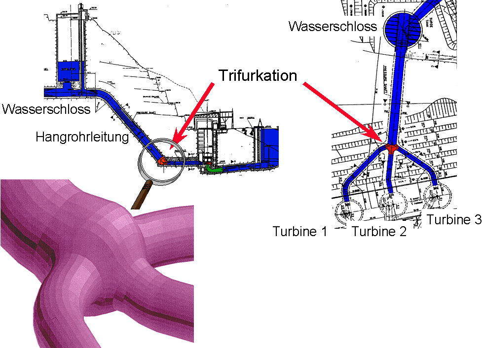

Leistungsschwankungen der Turbine verursacht durch Trifurkation

[1] Hoffmann, H., Roswora, R.R., Egger, A.: Rectification of Marsyangdi 
    Trifurcation; Hydro Vision 2000 Conference Technical Papers, HCI 
    Publications Inc.

### Anwendung: Wasserkraftwerk in Nepal

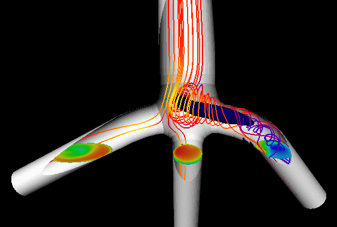

[1] Hoffmann, H., Roswora, R.R., Egger, A.: Rectification of Marsyangdi 
    Trifurcation; Hydro Vision 2000 Conference Technical Papers, HCI 
    Publications Inc.

### Anwendung: Wasserkraftwerk in Nepal

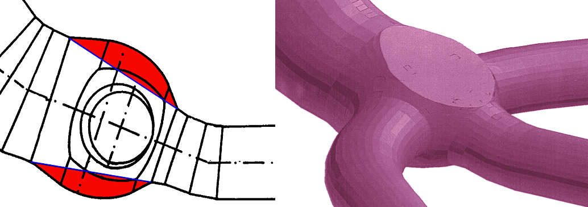

**Lösung:** Einbau von Blechen

[1] Hoffmann, H., Roswora, R.R., Egger, A.: Rectification of Marsyangdi 
    Trifurcation; Hydro Vision 2000 Conference Technical Papers, HCI 
    Publications Inc.

### Anwendung: Wasserkraftwerk in Nepal - 15 Jahre später

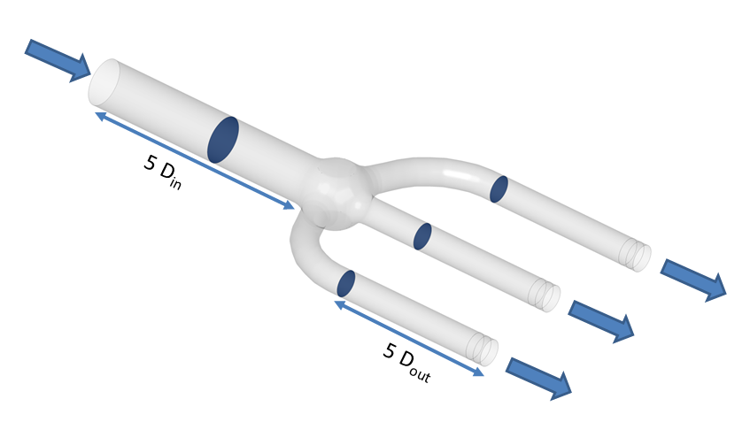

[1] Kirschner, O. et al.; Experimentelle und numerische Strömungsanalyse einer 
    Trifurkation eines 150-MW-Kraftwerkes; Wasserwirtschaft. 109; 2019;
    DOI: 10.1007/s35147-019-0223-3

### Anwendung: Wasserkraftwerk in Nepal - 15 Jahre später

Original

<video
    data-autoplay
    data-src="assets/nepal_org.mp4"
    loop="loop"
    width="475">
</video>

Modifikation

<video
    data-autoplay
    data-src="assets/nepal_opt.mp4"
    loop="loop"
    width="475">
</video>

[1] Kirschner, O. et al.; Experimentelle und numerische Strömungsanalyse einer 
    Trifurkation eines 150-MW-Kraftwerkes; Wasserwirtschaft. 109; 2019;
    DOI: 10.1007/s35147-019-0223-3

### Anwendung: Gezeitenströmung

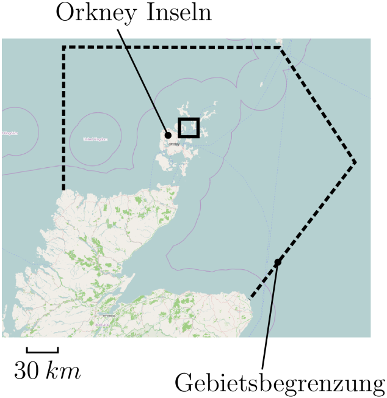
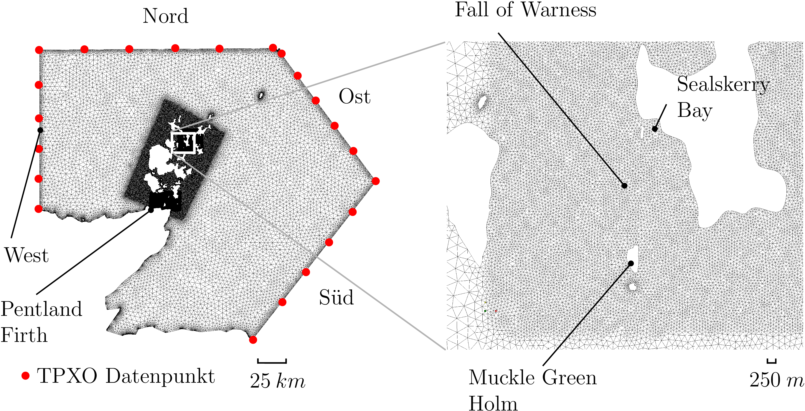

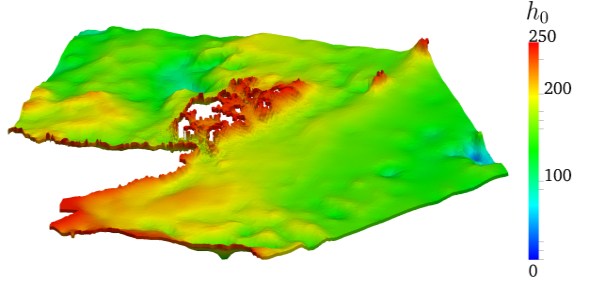

- Geometriedaten aus geometrischem Informationssystem (GIS)
- Kopplung von TPXO für Randbedingungen

[1] Ruopp, A.; Optimierung von symmetrischen Gezeitenströmungstubinen und deren 
    Analyse in großräumigen Gezeitenströmungsgebieten; 2016; 
    ISBN 978-3-9812054-2-8 

### Anwendung: Gezeitenströmung

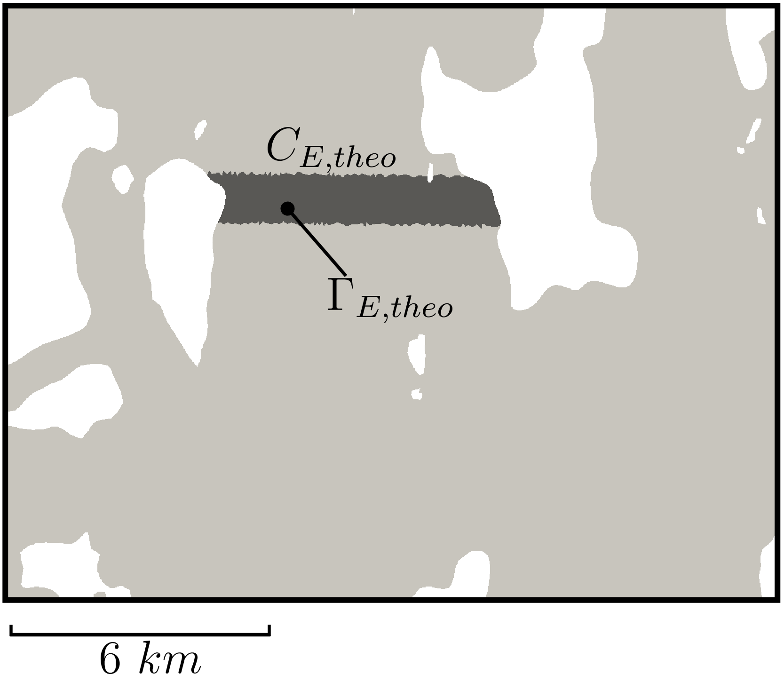

Theoretisches Potenzial über Kanalverblockung

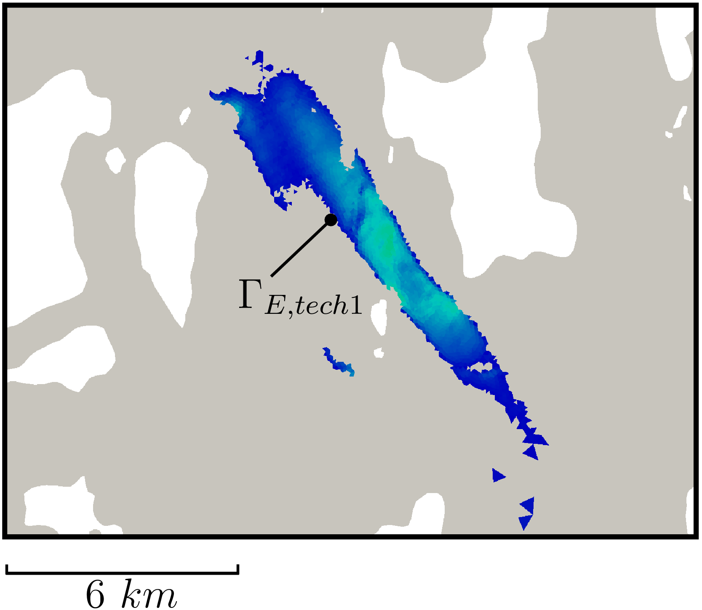

Technisches Potenzial über Verblockung der nutzbaren Fläche

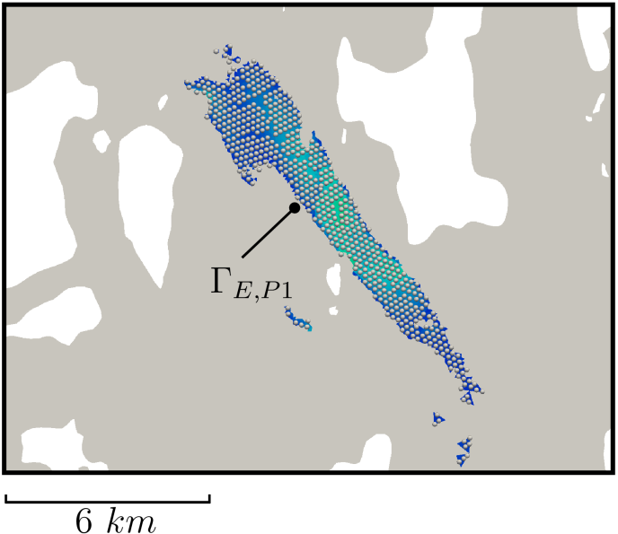

Reales Potenzial über Platzierung einzelner Turbinen 
  - Berücksichtigung der Hauptströmungsrichtungen
  - Fernfeldeinfluss mit Nachlaufschatten 

[1] Ruopp, A.; Optimierung von symmetrischen Gezeitenströmungstubinen und deren 
    Analyse in großräumigen Gezeitenströmungsgebieten; 2016; 
    ISBN 978-3-9812054-2-8 

### Anwendung: Gezeitenströmung

Zeitlicher Verlauf der Strömungsrichtung 
<video
    data-autoplay
    data-src="assets/tidal_sim-measure.mp4"
    loop="loop"
    width="375">
</video> 
Strömungsfeld in zwei Zeitschritten

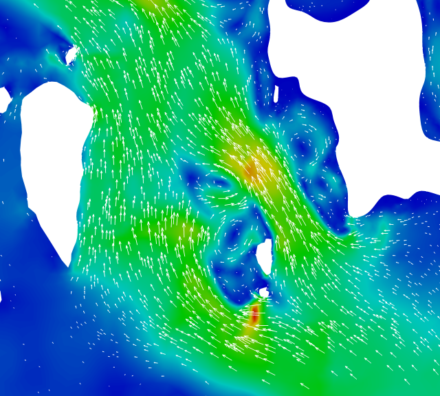

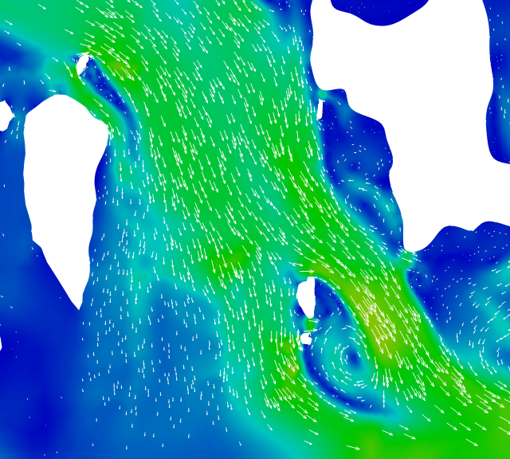

[1] Ruopp, A.; Optimierung von symmetrischen Gezeitenströmungstubinen und deren 
    Analyse in großräumigen Gezeitenströmungsgebieten; 2016; 
    ISBN 978-3-9812054-2-8 

### Anwendung: Gezeitenströmung

Beispiel des Verlaufs der Anströmbedingungen

<video
    data-autoplay
    data-src="assets/tidal_cfd.mp4"
    loop="loop"
    width="400">
</video>

- Starke Variation der lokalen Anströmrichtungen
- Turbinenverbund verblockt maßgeblich Kernströmung im Kanal

[1] Ruopp, A.; Optimierung von symmetrischen Gezeitenströmungstubinen und deren 
    Analyse in großräumigen Gezeitenströmungsgebieten; 2016; 
    ISBN 978-3-9812054-2-8 

